# Praktikum3
<h1> NAMA   :   DODOT GUNTUR SATRIA PUTRA <h1>
<h1> NIM    :   312110499 <h1>
<h1> KELAS  :   TI.21.C1 <h1>
<h1> TUGAS BAHASA PEMOGRAMAN <h1>

# LABSPY01
<h1> Latihan 1 <h1>
<h1> Program menentukan nilai terbesar dari 2 bilangan <h1>

 program sederhana dengan input dua buah bilangan yang diinputkan, dari ketiga bilangan
tersebut tampilkan bilangan terbesarnya. program ini menggunakan statement if...elif. 

 berikut code nya 

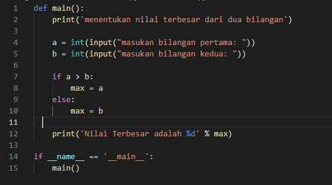

 kemudian run, input dua bilangan. misal 7629 dan 7382 

 maka hasil run nya seperti berikut 

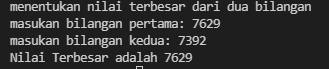

 nilai terbesar adalah 7629

<h1> latihan 2 <h1>
<h1> Mengurutkan data dari yang terkecil hingga terbesar <h1>

 ketika memasukan banyak angka, program akan mengurtkan data dari yang terkecil hingga terbesar 

 berikut code nya 

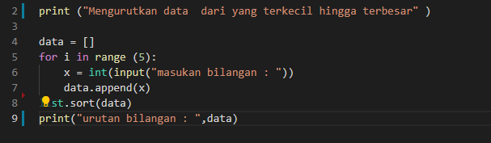

 kemudian run, input 5 angka . misal angka nya adalah 629, 463,964,184,182 

 maka hasil run seperti berikut 

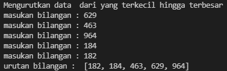

<h1> Latihan 3 <h1>
<h1> Program dengan perulangan bertingkat (nested) for <h1>

 berikut code nya 

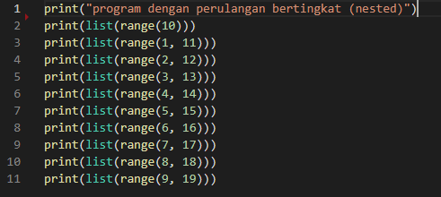

 maka hasil run seperti berikut 

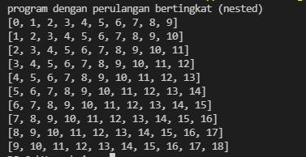

<h1> Latihan 4 <h1>
<h1> Menampilkan n bilangan acak yang lebih kecil dari 0.5 <h1>

 berikut code nya 

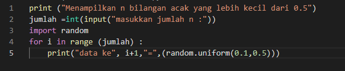

 kemudian run, maka hasilnya seperti berikut 

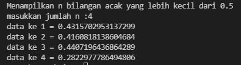

# LABSPY02
<h1> Latihan 1 <h1>
<h1> Program menentukan nilai akhir 

 program ini menggunakan statement if ... elif karna memerlukan beberapa kondisi 

 kondisi nya adalah jika hasil dari nilai tugas*2 ditambah nilai uts*4 dan ditambah nilai uas*4 adalah 

 jika hasilnya > 80 maka bernilai A

 jika hasilnya > 70 maka bernilai B

 jika hasilnya > 50 maka bernilai C

 jika hasilnya > 40 maka bernilai D 

 jika hasilnya tidak ada seperti diatas maka bernilai E 

 jika hasil nilai akhir > 60 maka "LULUS"

 jika hasil nilai akhir < 60 maka "TIDAK LULUS"

 berikut code nya 

 kemudian run, masukan nilai tugas,uts, dan uas 

 misal nilai uts 89, uas 67, dan tugas 72 

 maka hasil run seperti berikut 

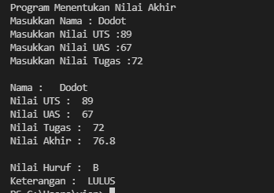

 hasil nilai akhir adalah 76,8 yang berarti bernilai B karna nilai > 70 

  karna hasil nilai akhir adalah 76.8 dan >60 maka keterangannya "LULUS"

 flowchartnya seperti berikut 

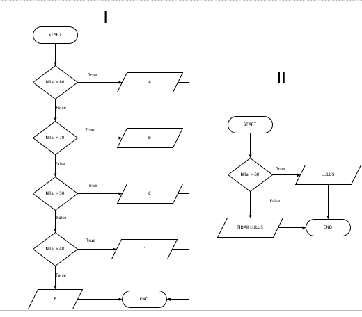

<h1> Latihan 2 <h1>
<h1> Menampilkan status gaji karyawan 

 program ini menggunakan statement if else 

 berikut kondisinya 

 jika gaji > 3000000 "GAJI SUDAH DIATAS UMR" tetapi jika gaji masih dibawah umr maka output langsung "gaji belum umr"

 bila gaji sudat diatas umr maka : 

 * jika sudah berkeluarga maka "wajib ikut asuransi dan menabung untuk pensiun, tetapi jika belum berkeluarga maka "tidak perlu ikut asuransi

 * jika sudah punya rumah maka "wajib bayar pajak rumah", jika belum punya rumah maka "tidak wajib bayar pajak rumah"

 berikut code nya 

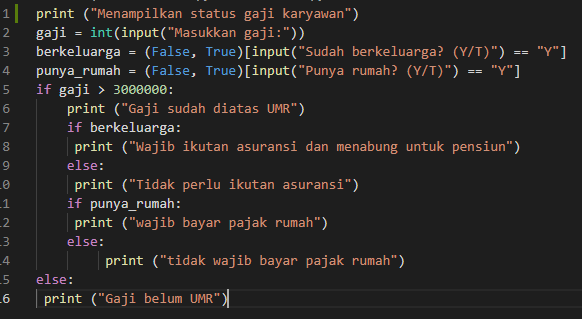

 kemudian run, jawab pertanyaannya

 misal gaji 6500000, sudah berkeluarga, dan sudah punya rumah

 maka hasil run seperti berikut 

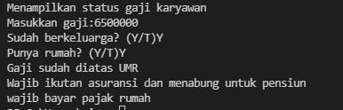

 flowchartnya seperti berikut 

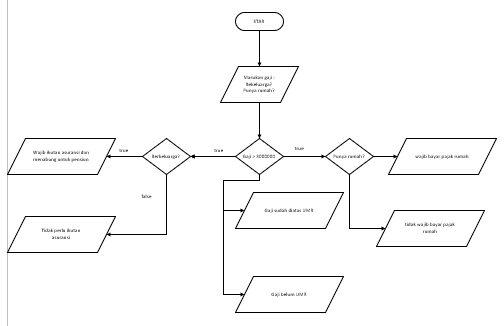

<h1> Latihan 3<h1>

 Penggunaan kondisi OR 

 program membandingkan 3 input bilangan, apabila penjumlahan 2 bilangan hasilnya
sama dengan bilangan lainnya, maka cetak pernyataan “BENAR” 

 berikut code nya 

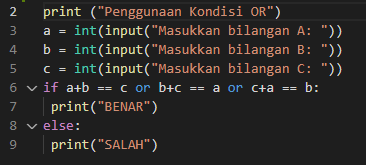

 kemudian run, masukan bilangan A,B,C 

 misal 4,9,5 

 maka hasilnya seperti berikut 

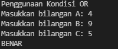

 outputnya adalah benar karna terdapat angka bilangan C+ bilangan A hasilnya bilangan B (4+5=9) 

 berikut flowchartnya 

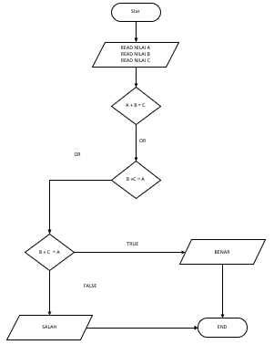

<h1> Latihan 4 <h1>
<h1> Program menentukan nilai terbesar dari 3 bilangan <h1>

 program sederhana dengan input tiga buah bilangan yang diinputkan, dari ketiga bilangan
tersebut tampilkan bilangan terbesarnya. program ini menggunakan statement if...elif. 

 berikut code nya 

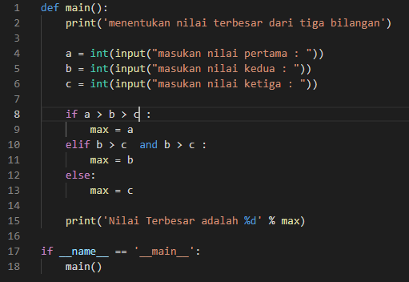

 kemudian run, masukan 3 bilangan angka 

 misal 72,94,35 

 maka hasil run seperti berikut 

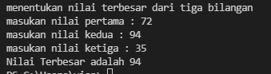

 flowchartnya seperti berikut 

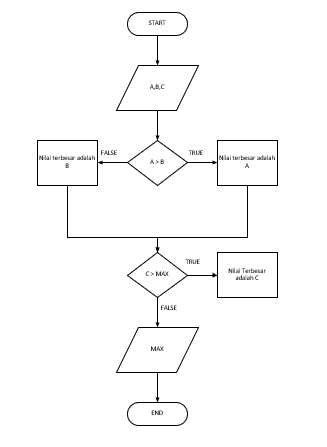

# LABSPY03 
<h1> Latihan 1 <h1>
<h1> Program menampilkan n bilangan acak yang lebih kecil 0.5 <h1>

 Berikut code nya 

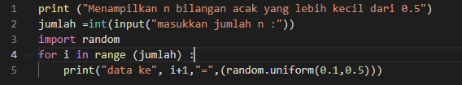

 hasil run seperti berikut 

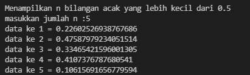

<h1> Latihan 2 <h1>
<h1> Menampilkan bilangan terbesar dari n buah data yang diinputkan <h1>

 program akan mengulang untuk memasukan bilangan, program akan berhenti ketika data yang diinputkan adalah 0 

 berikut code nya 

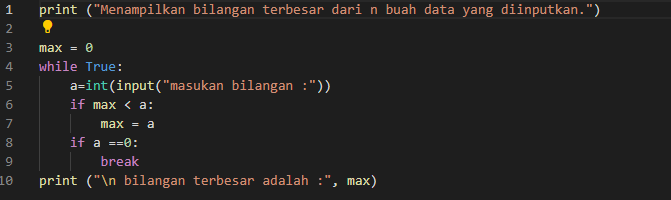

kemudian run, masukan data hingga program berhenti mengulang. hasil run nya seperti berikut 

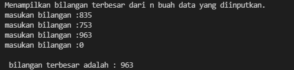

<h1> Program 1 <h1>
<h1> Laba investasi <h1>

 Program pengulangan dengan kondisi Seorang pengusaha menginvestasikan uangnya untuk memulai usahanya dengan
modal awal 100 juta, pada bulan pertama dan kedua belum mendapatkan laba. pada
bulan ketiga baru mulai mendapatkan laba sebesar 1% dan pada bulan ke 5,
pendapatan meningkat 5%, selanjutnya pada bulan ke 8 mengalami penurunan
keuntungan sebesar 2%, sehingga laba menjadi 3%. Hitung total keuntungan selama 8
bulan berjalan usahanya. 

 berikut code nya 

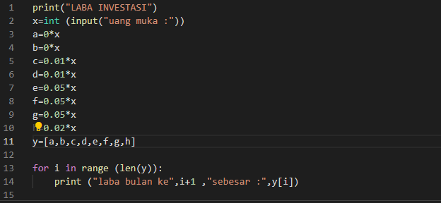

 kemudian run, masukan uang muka (100 juta). maka hasil run seperti berikut 

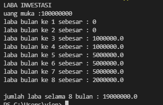

<h2> Selesai <h2>